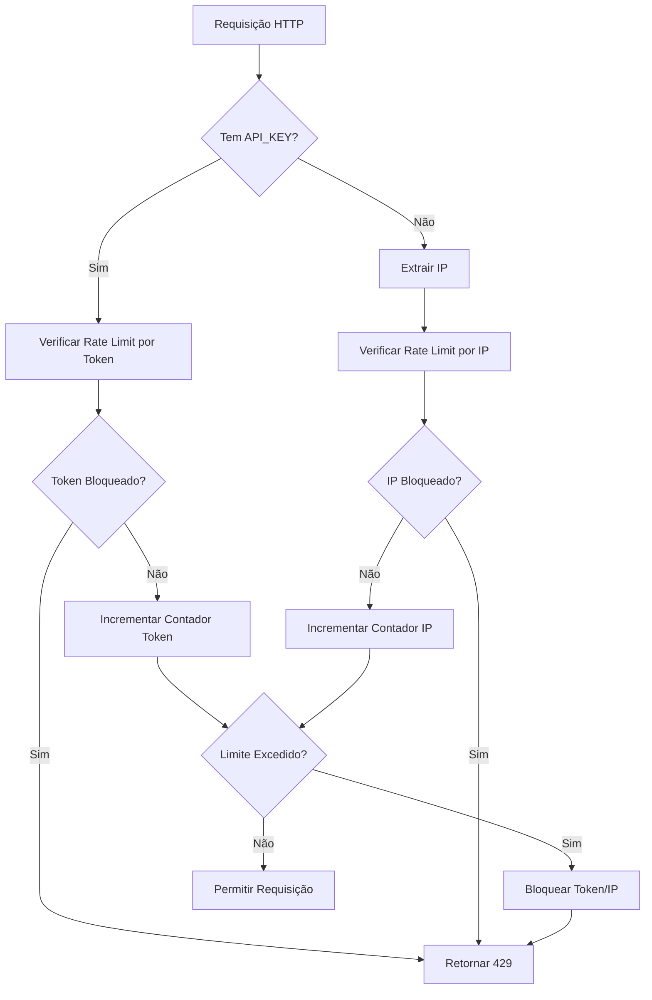

# Rate Limiter Go

Um sistema de rate limiting robusto e configurável implementado em Go, que oferece controle de taxa de requisições tanto por IP quanto por token de API.

## 📋 Índice

- [Visão Geral](#visão-geral)
- [Como Funciona](#como-funciona)
- [Arquitetura](#arquitetura)
- [Configuração](#configuração)
- [Instalação e Execução](#instalação-e-execução)
- [API Endpoints](#api-endpoints)
- [Exemplos de Uso](#exemplos-de-uso)
- [Testes](#testes)
- [Monitoramento](#monitoramento)

## 🎯 Visão Geral

Este rate limiter implementa um algoritmo de **sliding window** com janela de 1 segundo, oferecendo:

- **Rate limiting por IP**: Controle baseado no endereço IP do cliente
- **Rate limiting por Token**: Controle baseado em tokens de API (header `API_KEY`)
- **Bloqueio temporário**: Bloqueio automático quando limites são excedidos
- **Armazenamento flexível**: Suporte a Redis (produção) e memória (desenvolvimento)
- **Configuração dinâmica**: Limites personalizáveis por token

## ⚙️ Como Funciona

### Algoritmo de Rate Limiting

O sistema utiliza um algoritmo de **sliding window** com janela de 1 segundo:

1. **Contagem de Requisições**: Cada requisição incrementa um contador com TTL de 1 segundo
2. **Verificação de Limite**: Se o contador exceder o limite configurado, a requisição é bloqueada
3. **Bloqueio Temporário**: IPs/tokens bloqueados ficam bloqueados por um período configurável
4. **Expiração Automática**: Contadores e bloqueios expiram automaticamente

### Fluxo de Processamento



### Tipos de Rate Limiting

#### 1. Rate Limiting por IP
- **Identificação**: Extrai IP do header `X-Forwarded-For`, `X-Real-IP` ou `RemoteAddr`
- **Limite padrão**: 10 requisições por segundo
- **Chave de armazenamento**: `count:ip:{IP_ADDRESS}`

#### 2. Rate Limiting por Token
- **Identificação**: Header `API_KEY`
- **Limite padrão**: 100 requisições por segundo
- **Limites personalizados**: Suporte a limites específicos por token
- **Chave de armazenamento**: `count:token:{TOKEN}`

### Sistema de Bloqueio

Quando um limite é excedido:
1. **Bloqueio Imediato**: IP/token é bloqueado instantaneamente
2. **Duração Configurável**: Bloqueio dura por tempo configurável (padrão: 5 minutos)
3. **Chave de Bloqueio**: `block:ip:{IP}` ou `block:token:{TOKEN}`
4. **Expiração Automática**: Bloqueio expira automaticamente

## 🏗️ Arquitetura

### Estrutura do Projeto

```
rate-limiter-go/
├── cmd/api/           # Ponto de entrada da aplicação
├── config/            # Configurações e variáveis de ambiente
├── internal/
│   ├── domain/        # Entidades e interfaces de domínio
│   ├── infra/         # Implementações de infraestrutura
│   │   ├── storage/   # Implementações de armazenamento
│   │   └── web/       # Handlers e middleware HTTP
│   └── usecase/       # Lógica de negócio do rate limiter
├── test/              # Testes de integração e carga
└── docker-compose.yml # Configuração Docker
```

### Componentes Principais

#### 1. RateLimiter (Use Case)
- **Responsabilidade**: Lógica principal do rate limiting
- **Métodos principais**:
  - `CheckIP()`: Verifica limite por IP
  - `CheckToken()`: Verifica limite por token
  - `SetTokenLimit()`: Define limite personalizado para token

#### 2. Storage Interface
- **RedisStorage**: Armazenamento distribuído (produção)
- **MemoryStorage**: Armazenamento em memória (desenvolvimento)

#### 3. Middleware HTTP
- **RateLimiterMiddleware**: Intercepta requisições HTTP
- **Extração de IP**: Suporte a proxies e load balancers
- **Headers de Resposta**: `X-RateLimit-Remaining`

## 🔧 Configuração

### Variáveis de Ambiente

| Variável | Descrição | Padrão | Exemplo |
|----------|-----------|--------|---------|
| `RATE_LIMIT_IP` | Limite de requisições por IP por segundo | 10 | 5 |
| `RATE_LIMIT_TOKEN` | Limite de requisições por token por segundo | 100 | 50 |
| `BLOCK_DURATION_SECONDS` | Duração do bloqueio em segundos | 300 | 600 |
| `REDIS_HOST` | Host do Redis | localhost | redis |
| `REDIS_PORT` | Porta do Redis | 6379 | 6379 |
| `REDIS_PASSWORD` | Senha do Redis | "" | mypassword |
| `REDIS_DB` | Número do banco Redis | 0 | 1 |
| `SERVER_PORT` | Porta do servidor HTTP | 8080 | 8080 |

### Arquivo .env

```env
# Rate Limiting
RATE_LIMIT_IP=10
RATE_LIMIT_TOKEN=100
BLOCK_DURATION_SECONDS=300

# Redis Configuration
REDIS_HOST=localhost
REDIS_PORT=6379
REDIS_PASSWORD=
REDIS_DB=0

# Server Configuration
SERVER_PORT=8080
```

### Configuração Programática

```go
// Criar rate limiter com configurações personalizadas
limiter := usecase.NewRateLimiter(
    storage,           // Implementação de storage
    5,                // Limite por IP
    50,               // Limite por token
    10*time.Minute,   // Duração do bloqueio
)

// Definir limite personalizado para token específico
limiter.SetTokenLimit("premium-token", 1000)
```

## 🚀 Instalação e Execução

### Pré-requisitos

- Go 1.21+
- Redis (opcional, fallback para memória)

### Instalação Local

```bash
# Clonar repositório
git clone <repository-url>
cd rate-limiter-go

# Instalar dependências
go mod download

# Executar com Redis
docker-compose up -d redis
go run cmd/api/main.go

# Executar apenas com memória
go run cmd/api/main.go
```

### Docker Compose

```bash
# Executar com Docker Compose
docker-compose up -d

# Verificar logs
docker-compose logs -f api
```

### Build da Aplicação

```bash
# Build local
go build -o bin/rate-limiter cmd/api/main.go

# Build Docker
docker build -t rate-limiter .
```

## 🌐 API Endpoints

### GET /health
Verifica o status da aplicação.

**Resposta:**
```json
{
  "status": "ok"
}
```

### GET /test
Endpoint de teste que retorna informações da requisição.

**Headers de Requisição:**
- `API_KEY` (opcional): Token para rate limiting por token

**Resposta:**
```json
{
  "message": "Request successful",
  "ip": "192.168.1.100"
}
```

**Headers de Resposta:**
- `X-RateLimit-Remaining`: Número de requisições restantes

### Respostas de Erro

#### 429 Too Many Requests
```json
"you have reached the maximum number of requests or actions allowed within a certain time frame"
```

#### 400 Bad Request
```json
"Cannot determine IP address"
```

#### 500 Internal Server Error
```json
"Internal Server Error"
```

## 📝 Exemplos de Uso

### Rate Limiting por IP

```bash
# Requisições normais (até o limite)
curl http://localhost:8080/test

# Após exceder o limite (10 req/s por padrão)
curl http://localhost:8080/test
# Resposta: 429 Too Many Requests
```

### Rate Limiting por Token

```bash
# Com token válido
curl -H "API_KEY: my-token" http://localhost:8080/test

# Token bloqueado após exceder limite
curl -H "API_KEY: my-token" http://localhost:8080/test
# Resposta: 429 Too Many Requests
```

### Configuração de Limites Personalizados

```go
// No código da aplicação
limiter.SetTokenLimit("premium-user", 1000)
limiter.SetTokenLimit("basic-user", 10)
```

### Monitoramento com Headers

```bash
# Verificar requisições restantes
curl -I http://localhost:8080/test
# X-RateLimit-Remaining: 9
```

## 🧪 Testes

### Testes Unitários

```bash
# Executar todos os testes
go test ./...

# Testes específicos
go test ./internal/usecase/
go test ./internal/infra/storage/
```

### Testes de Integração

```bash
# Executar testes de integração
go test ./test/
```

### Testes de Carga

```bash
# Executar script de teste de carga
chmod +x test/load_test.sh
./test/load_test.sh
```

### Exemplo de Teste Manual

```bash
# Teste rápido de rate limiting
for i in {1..15}; do
  echo "Request $i:"
  curl -s -w "Status: %{http_code}, Remaining: %{header_json}X-RateLimit-Remaining\n" \
    http://localhost:8080/test
  sleep 0.1
done
```

## 📊 Monitoramento

### Métricas Importantes

1. **Taxa de Bloqueio**: Percentual de requisições bloqueadas
2. **Distribuição de IPs**: IPs mais frequentes
3. **Uso de Tokens**: Tokens mais utilizados
4. **Performance**: Latência das operações de storage

### Logs da Aplicação

```bash
# Ver logs em tempo real
docker-compose logs -f api

# Logs específicos
docker-compose logs api | grep "rate limit"
```

### Monitoramento Redis

```bash
# Conectar ao Redis
redis-cli

# Verificar chaves de rate limiting
KEYS count:*
KEYS block:*

# Monitorar comandos em tempo real
MONITOR
```

### Health Check

```bash
# Verificar saúde da aplicação
curl http://localhost:8080/health

# Verificar conectividade Redis
docker-compose exec redis redis-cli ping
```

## 🔒 Considerações de Segurança

### Proteção contra Bypass

- **Validação de IP**: Suporte a headers de proxy confiáveis
- **Validação de Token**: Tokens são validados antes do rate limiting
- **Bloqueio Distribuído**: Bloqueios são compartilhados entre instâncias

### Recomendações

1. **Use Redis em Produção**: Para consistência entre múltiplas instâncias
2. **Configure Limites Adequados**: Baseado no comportamento esperado
3. **Monitore Bloqueios**: Para detectar ataques ou problemas
4. **Use HTTPS**: Para proteger tokens em trânsito

## 🚀 Deploy em Produção

### Configuração Recomendada

```env
# Produção
RATE_LIMIT_IP=5
RATE_LIMIT_TOKEN=100
BLOCK_DURATION_SECONDS=600
REDIS_HOST=redis-cluster.internal
REDIS_PASSWORD=secure-password
SERVER_PORT=8080
```

### Docker Compose para Produção

```yaml
version: '3.8'
services:
  redis:
    image: redis:7-alpine
    command: redis-server --appendonly yes --requirepass secure-password
    volumes:
      - redis-data:/data
    deploy:
      resources:
        limits:
          memory: 512M

  api:
    build: .
    environment:
      - RATE_LIMIT_IP=5
      - RATE_LIMIT_TOKEN=100
      - BLOCK_DURATION_SECONDS=600
      - REDIS_HOST=redis
      - REDIS_PASSWORD=secure-password
    deploy:
      replicas: 3
      resources:
        limits:
          memory: 256M
```

## 🤝 Contribuição

1. Fork o projeto
2. Crie uma branch para sua feature (`git checkout -b feature/AmazingFeature`)
3. Commit suas mudanças (`git commit -m 'Add some AmazingFeature'`)
4. Push para a branch (`git push origin feature/AmazingFeature`)
5. Abra um Pull Request

## 📄 Licença

Este projeto está licenciado sob a Licença MIT - veja o arquivo [LICENSE](LICENSE) para detalhes.

## 📞 Suporte

Para suporte e dúvidas:
- Abra uma issue no GitHub
- Consulte a documentação da API
- Verifique os logs da aplicação
